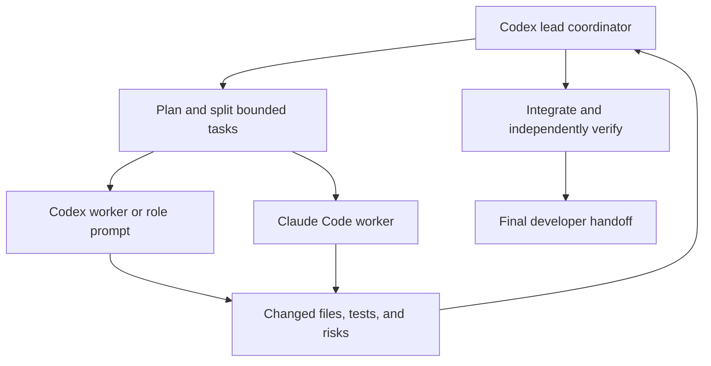
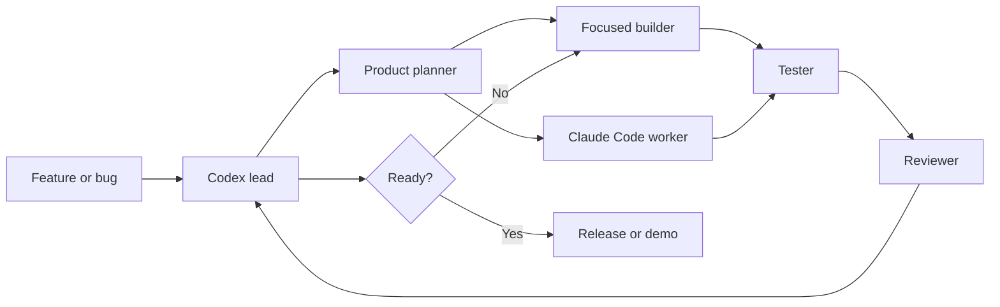

# Agent Playbook

This folder makes vibe-coded development more consistent. Codex is the lead agent: it chooses the work, delegates bounded tasks, integrates changes, and makes the final call. Claude Code is an optional worker for implementation, tests, or a second review; Fable is one of the Claude model choices it can use.

## Team model



### Lead responsibilities

- Keep a single source of truth for requirements and acceptance criteria.
- Delegate independent, non-overlapping tasks; do not allow two workers to edit the same files at once.
- Give every worker a bounded goal, relevant files, constraints, and expected validation.
- Review all worker output, resolve conflicts, run final checks, and decide what is complete.
- Treat worker output as evidence, not automatic approval.

### Claude Code worker rules

- Use Claude Code only for a clear, scoped task supplied by the lead.
- Ask it to inspect before editing and to report changed files, commands, results, and risks.
- Do not let it make release, security, product-scope, or merge decisions.
- Review its diff and rerun relevant tests before integrating it.

## Claude model selection

Use the newest model available through your Claude Code account or provider. Model availability and exact aliases can change, so prefer the `sonnet` and `opus` CLI aliases unless a task requires a pinned model.

| Model family | Use it for | Avoid it for |
| --- | --- | --- |
| **Haiku** | Fast, low-cost work: summarizing logs, classifying issues, formatting fixtures, simple documentation edits, and repetitive test-case generation. | Ambiguous debugging, multi-file architecture changes, security-sensitive review, or complex tool-use tasks. |
| **Sonnet** | Default coding worker: scoped implementation, refactors, test writing, debugging with clear reproduction steps, and standard code review. | Problems where the agent must reconcile many competing designs or investigate a subtle system-wide failure. |
| **Opus** | High-stakes or difficult work: architecture decisions, complex debugging, root-cause analysis, security/design review, and a final second opinion on a large change. | Routine formatting, mechanical edits, or simple tasks where its additional cost and latency are not justified. |
| **Fable** | Broad planning, challenging a design, difficult root-cause analysis, or a second-pass review of a substantial change, when it is available in Claude Code. | Mechanical edits, formatting, routine fixture changes, or any task that needs a small, fast implementation pass. |

For AgentEval specifically:

- Start with **Sonnet** for a bounded feature or bug fix.
- Use **Haiku** for log triage, fixture expansion, or concise documentation cleanup after a lead supplies precise instructions.
- Escalate to **Opus** when behavior differs across baseline/candidate versions and the cause is unclear, or when reviewing scoring and evaluation architecture.
- Select **Fable** for a high-level plan, difficult investigation, or an adversarial second review when it is available in the Claude model picker.
- Do not switch models mid-task merely to retry the same vague prompt. Improve the task brief, attach the failing trace/test, and give the next worker a concrete acceptance criterion.

Claude Code supports selecting a model for a session with `--model`; use the short aliases where supported:

```bash
claude --model sonnet
claude --model opus
```

Anthropic positions Opus for its most capable reasoning and coding work, Sonnet as the high-performance efficiency choice, and recommends Haiku for simple tasks while using Sonnet or Opus for complex tools and ambiguous requests. See the official [Claude overview](https://docs.anthropic.com/en/docs/welcome), [Claude Code CLI reference](https://docs.anthropic.com/en/docs/claude-code/cli-usage), and [model-pricing guidance](https://docs.anthropic.com/en/docs/about-claude/pricing).

## When to select Fable

Fable is a Claude model. Select it in Claude Code only when it is available for the team's account; do not make the repository, CI, or local developer workflow depend on a Fable-specific command or model identifier.

| Situation | Best use of Fable | Lead follow-up |
| --- | --- | --- |
| New multi-component feature | Produce a component map, risks, and a split into non-overlapping tasks. | Codex approves the plan and delegates implementation. |
| Hard baseline/candidate behavior difference | Generate competing root-cause hypotheses and identify evidence needed to distinguish them. | A builder adds diagnostics/tests; Codex verifies the conclusion. |
| Design or scoring review | Challenge assumptions, edge cases, threshold choices, and artifact contracts. | Codex resolves decisions and records them in project documentation. |
| Large pull request | Perform a second-pass review focused on cross-file consistency and regressions. | Codex reviews findings and decides which changes to accept. |

Do not use Fable for mechanical formatting, routine fixture edits, or independent release decisions. For those, prefer Haiku or Sonnet and preserve Fable capacity for tasks that benefit from broader analysis.

## Shared collaboration contract

Codex and Claude Code, regardless of the selected Claude model, must leave work in a form the other agent can safely continue.

### Visible admin chat

Use [`ADMIN-AGENT-CHAT.md`](../ADMIN-AGENT-CHAT.md) for all cross-agent handoffs and decisions the developer should be able to inspect. The Codex lead opens a task entry before delegating and closes it with verification after the work is reviewed. Claude Code responds beneath the same task entry; it must not silently change scope.

| Area | Required convention |
| --- | --- |
| Task ownership | The Codex lead assigns one owner per file or module at a time. Split tasks by component, not by arbitrary subtasks that touch the same files. |
| Task brief | Every handoff names the goal, allowed files, excluded files, acceptance criteria, and validation command. |
| Decisions | Record important design decisions in the relevant Markdown or issue/task notes, including the reason and rejected alternative. |
| Artifacts | Keep intent suites, tool snapshots, traces, and reports in documented locations with stable schemas. |
| Tests | A worker must state what it ran and what it did not run. The lead performs final verification after merging work. |
| Git changes | Inspect the working tree before editing. Do not overwrite, reset, or discard another worker's changes. |
| Truthfulness | Mark live and replay evaluation output clearly. Never fabricate traces, results, test output, or model behavior. |

### Handoff template

```text
Owner: [Codex / Claude Code / developer]
Task: [completed concrete outcome]
Changed: [files]
Validation: [commands and result]
Evidence: [trace, report, test, or screenshot path]
Risks / follow-up: [none, or specific items]
```

## Fast workflow

1. Start with `roles/product-planner.md` when the task is unclear or crosses components.
2. The Codex lead delegates one or more non-overlapping implementation tasks.
3. Use Claude Code when a second implementation or review pass is useful.
4. Run `roles/tester.md` after implementation.
5. Use `roles/reviewer.md` before merging any meaningful change.
6. Use `roles/release.md` when preparing a demo, CI run, or release.

## Rules for every agent

- Read `AGENTS.md`, the relevant source files, and existing tests before editing.
- State the assumption being made if requirements are incomplete.
- Keep changes small and avoid unrelated cleanup.
- Add or update tests when behavior changes.
- Report changed files, commands run, results, and remaining risks.
- Never invent model results, tool traces, benchmark scores, or external research.

## Prompt starter

```text
Act as the [ROLE] worker for AgentEval. The Codex lead owns final decisions.
Read AGENTS.md and .agents/roles/[ROLE].

Goal: [ONE concrete outcome]
Scope: [files/components that are in scope]
Constraints: [tests, compatibility, time, or design constraints]

Make the smallest complete change. Verify it. At the end, report changed files,
validation performed, results, and any remaining risk. Do not modify unrelated files.
```

## Suggested role sequence


