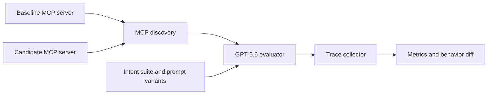

# AgentEval: Behavior Diffs for MCP Tools

## Final hackathon proposal — deliberately narrow, buildable in 3–4 days

**Pitch:** A one-line MCP tool-description change can leave every test green while making an AI agent much less likely to find the right tool. AgentEval detects that regression before merge.

AgentEval is a CI-style evaluator for one high-value agent behavior: **tool discoverability**. It repeatedly asks GPT-5.6 to solve representative user intents against a baseline and a changed MCP server, then posts a **behavior diff** showing whether the model still selects the intended tool reliably.

This is not a general agent platform for the hackathon. It is a focused, credible wedge into behavioral evaluation: quantify whether an MCP change makes a capability harder for an agent to discover.

---

## The exact problem

MCP servers are often tested for protocol correctness, schema validity, and tool implementation. Those checks cannot answer this:

> After this change, can an agent still recognize which tool solves the user’s request?

That question matters because models interpret natural-language tool names and descriptions. A harmless-looking edit can introduce ambiguity, overlap, or lost context.

Example:

```text
Baseline
find_travel_policy — “Returns the company policy for business travel.”

Candidate
find_travel_policy — “Searches company information.”
```

Both servers are valid. Both tools execute. But the candidate can become confused with a generic `search_docs` tool, causing an agent to take the wrong path.

---

## The product artifact: a behavior diff

AgentEval compares the same intent suite against two versions of an MCP server.

```text
PR #42 — simplified find_travel_policy description

Intent: Find the policy for international business travel
Trials: 24 per version (same 6 prompt variants × 4 runs)

Metric                              baseline       candidate       delta
Correct-tool discoverability        23/24 (96%)    14/24 (58%)     -38 pts
Valid first-call arguments          22/24 (92%)    13/24 (54%)     -38 pts
Median tool calls before success    1              2               +1

REGRESSION: discoverability fell below the 75% reliability floor.
Likely cause: `find_travel_policy` now overlaps semantically with `search_docs`.
Evidence: 9 candidate traces selected `search_docs` first.
```

The key idea is not “a test failed.” It is:

> **This code diff produced a measurable behavior diff.**

---

## Why repeated runs matter

Agent behavior is not reliably represented by one success or failure. AgentEval therefore records a rate across a fixed, visible sample instead of claiming a binary truth.

For the MVP:

- Each intent uses **6 meaning-preserving prompt variants**.
- Each variant runs **4 times** per server version.
- Every displayed metric is therefore out of **24 trials per intent per version**.
- A regression is flagged only when both conditions hold:
  1. discoverability drops by **at least 25 percentage points**, and
  2. the candidate falls below a **75% reliability floor**.

This is deliberately a clear product threshold, not a claim of publication-grade statistical significance. The report displays the raw `n`, counts, and traces so a developer can judge the signal. The production roadmap can add confidence intervals and adaptive sampling; the hackathon MVP proves the workflow honestly.

---

## Narrow MVP scope

### The MVP does exactly four things

1. Launch a baseline and candidate MCP server in isolated local processes.
2. Discover their tool definitions.
3. Run a fixed intent suite through GPT-5.6 and capture the first tool call, arguments, and outcome.
4. Produce a single terminal/HTML behavior-diff report with trace evidence.

### The MVP measures only

- intended-tool selection rate;
- valid first-call argument rate; and
- tool calls before a validated outcome.

### Explicit non-goals

- No hosted service, user accounts, or database.
- No GitHub App; a polished local CLI/report is enough. A GitHub Check is a static mock in the demo video, not a dependency.
- No framework adapters beyond MCP.
- No generalized LLM-as-judge or arbitrary outcome grading.
- No model-comparison matrix, broad benchmark suite, fault injection, or dashboard.

This scope makes the product easy to understand and hard to dismiss as vaporware.

---

## Technical design



Each evaluator run receives one user intent and the tools discovered from the selected server version. It may call tools normally; the harness records the first choice, validates arguments against the tool schema, and checks a simple deterministic success predicate from the demo server.

The demo server is intentionally small and deterministic. That isolates the question we are evaluating—whether the model can discover the right tool—from unrelated API reliability.

### Live and fallback modes

- **Live mode:** uses GPT-5.6 for the full evaluation, with a configurable run count.
- **Quick mode:** runs 2 variants × 2 repetitions (4 trials per version) so a judge can see a live end-to-end trace quickly.
- **Replay mode:** ships with captured live traces and renders the full 24-trial report without an API key or network. It is clearly labelled replay data, never presented as a fresh live result.

This makes the project runnable by judges while avoiding a long, expensive live demo.

---

## Demo: one planted regression, one real regression

### 1. The visual proof (controlled)

The baseline/candidate demo server changes only the description of `find_travel_policy`. The candidate becomes ambiguous beside `search_docs`. The report shows that all protocol checks remain green while discoverability declines.

This gives the judges a clean, comprehensible before/after moment.

### 2. The credibility proof (historical)

Before submission, we will select one small, public, unauthenticated MCP server with a tool-definition change in its Git history. AgentEval will compare the parent commit to the changed commit using two or three manually written intents.

The goal is modest: demonstrate that the same evaluator can analyze a change the team did not invent. We will only claim what the data shows. If the historical change does not regress, that is still a useful behavior-diff result; we will not manufacture a conclusion.

---

## Competitive positioning

We will not claim that AgentEval is the first MCP evaluation tool. MCP Inspector, mcp-eval, MCP Observatory, and general tracing tools already provide valuable protocol inspection, scenario testing, observability, and version comparisons.

Our narrow claim is:

> **AgentEval makes repeated-run tool-discoverability changes visible as a PR-ready behavior diff.**

Before recording the video, we will verify the current capabilities of mcp-eval and MCP Observatory. If either already supports this exact multi-trial rate comparison, we will position AgentEval as a simplified, developer-focused implementation or adjust the language—never claim novelty we cannot substantiate.

---

## Codex and GPT-5.6 story

### GPT-5.6 in the product

GPT-5.6 is the evaluation agent in the live path. It receives real discovered MCP tool definitions, selects tools for each natural-language intent, and generates the behavior being measured. The project evaluates its observable tool-use traces rather than merely comparing schemas.

### Codex in the build — the judging story

Codex is part of how the team builds the core functionality, not a vague future feature:

- We use Codex to scaffold the MCP harness, trace schema, evaluator runner, and report renderer.
- We use Codex to iterate on the baseline/candidate servers and write focused unit tests for the aggregation logic.
- We use Codex to inspect real historical MCP changes and produce the small intent suite for the external proof point.
- We record the `/feedback` session ID from the Codex session where the evaluator and differential-report core are built, and include it in the submission.

In the video, we will show a real Codex interaction that shaped the evaluator or report—not just a generic code-generation clip.

---

## 3–4 day execution plan

| Day | Deliverable | Definition of done |
| --- | --- | --- |
| Day 1 | Harness + demo MCP servers | Tools are discovered; one live GPT-5.6 run can call each server; traces are saved. |
| Day 2 | Repeated-run metrics + report | 24-trial evaluation runs or replays; counts, rates, thresholds, and trace evidence render correctly. |
| Day 3 | Polish + historical proof | Quick/live/replay modes work; one public-history comparison is documented; README and tests are complete. |
| Day 4 | Submission package | Video, screenshots, license/repo access, `/feedback` ID, and final verification are complete. |

### Cut line

If time gets tight, preserve this in order:

1. Baseline/candidate MCP comparison with replay mode.
2. Clear 24-trial behavior diff and trace drill-down.
3. One live quick run with GPT-5.6.
4. Historical proof point.
5. Static GitHub Check-style screenshot.

Do not spend time building an integration, dashboard, or a second adapter before the core behavior diff is persuasive.

---

## Submission and demo checklist

### Repository

- Add an OSI-approved `LICENSE` file (MIT is a simple default).
- Publish a README with prerequisites, install steps, the exact demo commands, sample data, replay-mode explanation, and expected output.
- Document GPT-5.6 configuration and the required environment variable without committing secrets.
- If the repository must remain private, share it with both required evaluation addresses from the event rules before submitting.

### Video (target: 2:30–3:00)

1. **0:00–0:20 — problem:** a valid MCP change can silently reduce an agent’s ability to find a tool.
2. **0:20–1:15 — product demo:** run/replay the behavior diff; show `23/24 → 14/24`, the reliability threshold, and one wrong-tool trace.
3. **1:15–1:45 — real proof:** show the historical public-server comparison and state the result plainly.
4. **1:45–2:25 — technology:** show the evaluator pipeline, GPT-5.6 making tool calls, and the quick live mode.
5. **2:25–2:50 — Codex build story:** show how Codex helped build the harness/report and name the captured `/feedback` session ID.
6. **2:50–3:00 — close:** “Code diffs tell us what changed. AgentEval tells us how agent behavior changed.”

---

## Closing

AgentEval does not try to solve every aspect of agent evaluation in four days. It solves one concrete, emerging problem well:

> **When an MCP tool changes, did the agent become less likely to find and use it correctly?**

By turning repeated GPT-5.6 tool-use traces into a plain-English behavior diff, AgentEval gives developers a new CI artifact for agentic software—and gives judges a small, real, runnable product with a memorable point of view.
